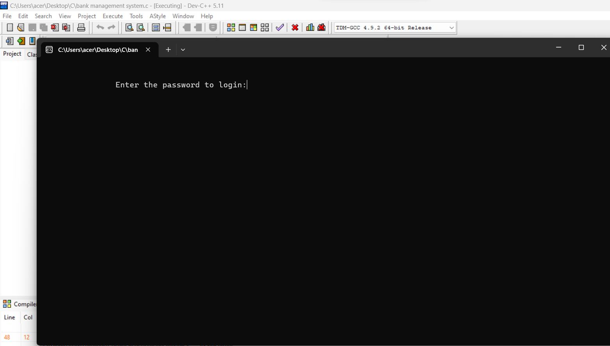
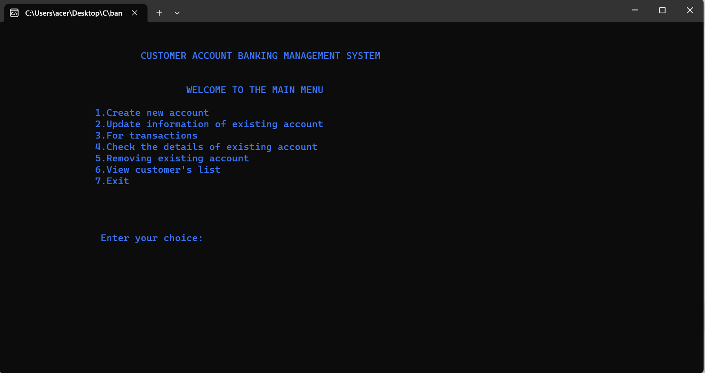

This is a  bank Management System created using C language. It will first ask for a password to access the menu.If an incorrect password is entered , then it will ask the user to try again. On enetering the correct password, the user can add an account, update it, check the details of the account and view the list of customers

## Requirements
* Dev C++
* C

## Code 

* [Code](code/bank management system.c)
